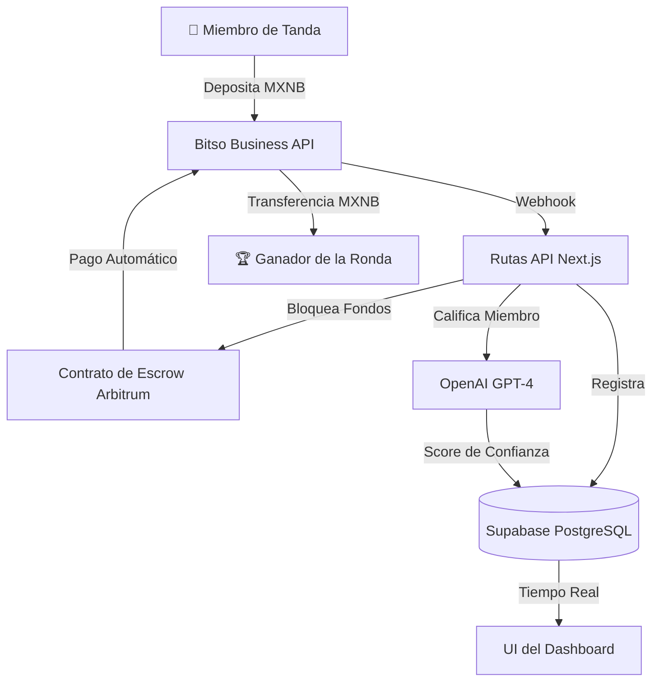

<div align="center">
  <h1>Tandot 🎰</h1>
  <p><em>¿Tu organizador de tanda se fue con el dinero? Nunca más. IA + contratos inteligentes garantizan cada pago.</em></p>
  

  <br/>

  [](https://tandot.edycu.dev)
  [](https://tandot.edycu.dev/pitch)
  [](https://youtu.be/gQ0IduJwbo0)
  [](https://sepolia.arbiscan.io/address/0x8413eCc78A8110D0EA05F346c9c2C7d0886B352c)
  [](https://dorahacks.io/hackathon/ethmexico2026bitso/detail)

  <br/>

  
  
  
  
  
  
  
  
  [](https://github.com/edycutjong/tandot/actions/workflows/ci.yml)

  <p>
    <a href="README.md">🇺🇸 English Version</a>
  </p>
</div>

---

## 📸 Míralo en Acción

<div align="center">
  <h3>1. Plataforma de Ahorro sin Confianza</h3>
  
  <br/><br/>

  <h3>2. Dashboard impulsado por IA</h3>
  
  <br/><br/>

  <h3>3. Flujo Automatizado de Escrow en Arbitrum</h3>
  
</div>

> **Tres pasos, cero confianza ciega.** Únete → Contribuye en MXNB → Cobra tu turno.

---

## 💡 El Problema y la Solución

En México, las **tandas** son la herramienta de ahorro informal más popular, sin embargo, 1 de cada 3 tandas falla porque el organizador desaparece con el dinero. No hay recursos legales, ni seguros, ni pruebas.

**Tandot** elimina al organizador humano por completo. Un agente de IA gestiona la puntuación de confianza, el emparejamiento de grupos y la detección de fraudes, mientras que el MXNB (la stablecoin del peso mexicano) fluye a través de contratos inteligentes de depósito en garantía (escrow) en Arbitrum, garantizando cada pago en cada ronda, siempre.

**Características Clave:**
- 🤖 **Puntuación de Confianza por IA:** GPT-4 evalúa la fiabilidad de cada miembro (0-100) mediante un análisis de 5 factores: historial de pagos, tasa de puntualidad, diversidad del grupo, antigüedad de la cuenta y calidad de las referencias.
- 💰 **Escrow de MXNB en Arbitrum:** Todas las contribuciones fluyen hacia un contrato inteligente sin necesidad de confianza; los fondos se bloquean hasta que se cumplen las condiciones de pago automático.
- 🔒 **Diseño a Prueba de Fraude:** Ninguna persona individual controla el pozo común. El contrato impone el orden de rotación y la IA marca a los miembros riesgosos antes de que se unan.
- 🎨 **UX Premium Bilingüe:** Diseño emocional pensado primero en español con profundidad técnica en inglés. Estética fintech de glassmorphism, modo oscuro, tipografía Inter + JetBrains Mono + Outfit.

## 🏗️ Arquitectura y Stack Tecnológico

| Capa | Tecnología |
|---|---|
| **Frontend** | Next.js 16 (App Router), React 19 |
| **Estilos** | Tailwind CSS v4 |
| **Base de Datos** | Supabase (PostgreSQL + Realtime) |
| **Pagos** | API de Bitso Business (Depósitos, Pagos, MXNB, Webhooks, Pagos Masivos) |
| **Cadena** | Arbitrum Sepolia (Stablecoin MXNB, contrato inteligente de escrow) |
| **IA** | OpenAI GPT-4 (puntuación de confianza, emparejamiento, detección de fraude) |
| **Despliegue** | Vercel |



## 🏆 Tracks de Patrocinadores Objetivados

| Recompensa (Bounty) | Premio | Integración |
|---|---|---|
| **Bitso Business Startup** | $3,900 | Depósitos, Pagos, transferencias MXNB, Webhooks, Pagos Masivos — ver `src/lib/` |
| **ETH México Principal** | $1,500 | Plataforma DeFi completa que resuelve la confianza financiera en LATAM |
| **Arbitrum** | $650 | Contrato inteligente de escrow desplegado en Arbitrum — ver `contracts/` |


## 🚀 Comenzando

### Prerrequisitos
- Node.js ≥ 20
- npm

### Instalación
```bash
git clone https://github.com/edycutjong/tandot.git
cd tandot
npm install
cp .env.example .env.local   # Agrega tus llaves de API
npm run dev                  # http://localhost:3000
```

### 🧑‍⚖️ Para Jueces — Inicio Rápido

> **No se requiere iniciar sesión, ni desplegar, ni llaves de API para explorar el dashboard.**

| Qué | Estado |
|---|---|
| **Wallet** | Instala [MetaMask](https://metamask.io) → cambia a **Arbitrum Sepolia** |
| **Contratos Inteligentes** | ✅ Ya desplegados (ver direcciones abajo) |
| **Base de Datos Supabase** | ✅ Pre-sembrada con datos de demostración |
| **API de Bitso** | ✅ Llaves de staging incluidas en el demo — no necesitas cuenta personal |
| **OpenAI** | ✅ La puntuación de confianza funciona con scores pre-calculados en modo demo |
| **ETH de Prueba** | Obtén ETH gratis en el [Faucet de Arbitrum Sepolia](https://faucet.quicknode.com/arbitrum/sepolia) |

### Contratos Desplegados (Arbitrum Sepolia)

| Contrato | Dirección |
|---|---|
| **TandaEscrow** | [`0x8413eCc78A8110D0EA05F346c9c2C7d0886B352c`](https://sepolia.arbiscan.io/address/0x8413eCc78A8110D0EA05F346c9c2C7d0886B352c) |
| **MockMXNB (ERC-20)** | [`0x0B551C18aAF6b1c1c12c026e7ABd2CFAd511BFe7`](https://sepolia.arbiscan.io/address/0x0B551C18aAF6b1c1c12c026e7ABd2CFAd511BFe7) |

> **Para Jueces:** Los contratos ya están en vivo; no es necesario desplegarlos. El dashboard lee estas direcciones automáticamente.

### Redesplegar Contratos (Opcional)

Para desplegar tu propia instancia del contrato de escrow y el token Mock MXNB:

```bash
cd contracts
npm install
cp .env.example .env   # Agrega tu URL RPC de Arbitrum y Llave Privada
npx hardhat compile
npx hardhat run scripts/deploy.ts --network arbitrumSepolia
```

Luego actualiza `NEXT_PUBLIC_ESCROW_CONTRACT_ADDRESS` y `NEXT_PUBLIC_MXNB_TOKEN_ADDRESS` en `.env.local`.

### API de Bitso Business (Staging)

> ⚠️ **Usa el entorno de staging** — nunca el de producción para pruebas de hackathon.

1. Crea una cuenta en [`stage.bitso.com`](https://stage.bitso.com)
2. Genera llaves de API en la configuración de la API
3. Agrega `BITSO_API_KEY` y `BITSO_API_SECRET` a tu `.env.local`

## 🧪 Pruebas y CI

**Pipeline de 6 etapas:** Calidad (lint/typecheck/jest en frontend + tests de hardhat en contratos) → Seguridad (TruffleHog + npm audit) → Verificación de Compilación y presupuesto de bundles → Playwright E2E → Rendimiento (Lighthouse CI) → Puerta de Despliegue (Deploy Gate)

```bash
# ── Calidad de Código y Pruebas Unitarias ──
npm run lint          # ESLint
npm run lint:fix      # Auto-corregir problemas de lint
npm run typecheck     # Verificación estricta de TypeScript
npm run test          # Ejecutar pruebas Jest
npm run test:coverage # Reporte de cobertura de Jest
npm run ci            # Pipeline de calidad completo (lint + typecheck + test:coverage)

# ── Calidad de Contratos Inteligentes ───────
cd contracts
npx hardhat compile   # Compilación de Hardhat
npx hardhat test      # Pruebas unitarias de contratos en Hardhat

# ── Pruebas E2E y Rendimiento Avanzadas ─────
npm run e2e           # Pruebas E2E de Playwright (modo demo)
npm run e2e:ui        # Interfaz interactiva de Playwright E2E
npm run lighthouse    # Auditoría de cumplimiento de Lighthouse CI
```

### Resumen del Harness de Ingeniería

| Capa | Herramienta | Estado | Detalles |
|---|---|---|---|
| **Calidad de Código** | ESLint + TypeScript | ✅ | Modo estricto, cero errores o advertencias |
| **Pruebas Unitarias** | Jest | ✅ | 29 suites, 100 pruebas, 100% de cobertura en líneas/ramas/funciones/declaraciones |
| **Pruebas de Contrato** | Hardhat + Chai | ✅ | 28 pruebas de contratos inteligentes exitosas (depósitos, contabilidad aislada, pagos automáticos) |
| **Pruebas E2E** | Playwright | ✅ | 3 suites: pruebas de humo, responsividad móvil/tablet/desktop, flujo de creación de Tanda |
| **Seguridad (SAST)** | CodeQL | ✅ | Análisis de código estático automatizado en GitHub Actions |
| **Seguridad (SCA)** | Dependabot + Audit | ✅ | Escaneo de dependencias semanal y actualizaciones automatizadas |
| **Escaneo de Secretos** | TruffleHog | ✅ | Escaneo de secretos en el historial de commits en cada PR y push |
| **Rendimiento** | Lighthouse CI | ✅ | Configuración de presupuestos locales con ejecución de servidor automático |

## 📁 Estructura del Proyecto

```
tandot/
├── docs/              # Activos del README (hero, capturas de pantalla)
├── src/
│   ├── app/              # Páginas del App Router de Next.js 16
│   │   ├── page.tsx      # Página de inicio (hero bilingüe)
│   │   └── dashboard/    # Dashboard, vistas de detalle de tanda
│   ├── components/       # Componentes de React 19
│   └── lib/              # Tipos, constantes, datos simulados, clientes
├── db/
│   └── schema.sql        # Esquema de Supabase (tandas, miembros, contribuciones, pagos)
├── contracts/            # Contrato de escrow en Solidity
├── public/               # Icono, imagen OG
├── .env.example          # Plantilla de variables de entorno
├── .github/workflows/    # Pipeline de CI
├── README.md             # Versión en inglés
└── README.es.md          # Estás aquí

```

## 📄 Licencia

[MIT](LICENSE) © 2026 Edy Cu

## 🙏 Agradecimientos

Construido para **DoraHacks Ethereum México 2026**. Gracias a Bitso, Arbitrum y la comunidad de ETH México por las APIs, herramientas e inspiración.

¡Gracias por revisar este proyecto! 🇲🇽
