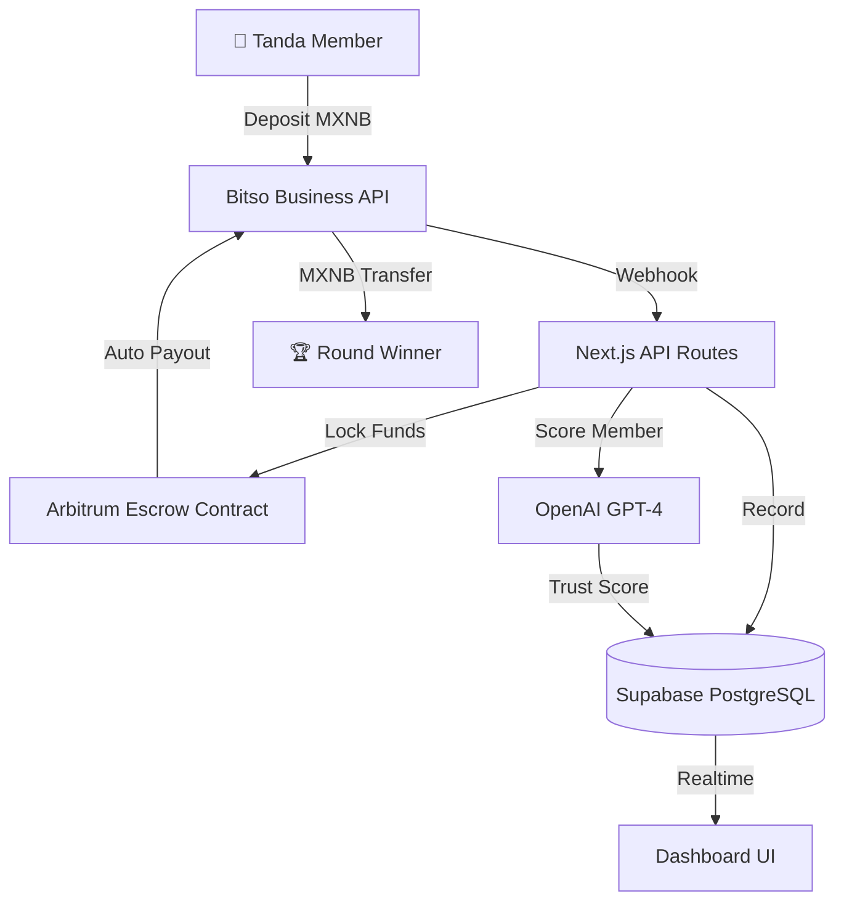

<div align="center">
  <h1>Tandot 🎰</h1>
  <p><em>"Did your tanda organizer run off with the money?"</em> — <strong>Never again.</strong><br/>
  AI + smart contracts guarantee every payout, protecting informal savings on-chain.</p>
  

  <br/>

  [](https://tandot.edycu.dev)
  [](https://tandot.edycu.dev/pitch)
  [](https://youtu.be/gQ0IduJwbo0)
  [](https://sepolia.arbiscan.io/address/0x8413eCc78A8110D0EA05F346c9c2C7d0886B352c)
  [](https://dorahacks.io/hackathon/ethmexico2026bitso/detail)

  <br/>

  
  
  
  
  
  
  
  
  [](https://github.com/edycutjong/tandot/actions/workflows/ci.yml)

  <p>
    <a href="README.es.md">🇲🇽 Versión en Español</a>
  </p>
</div>

---

## 📸 See it in Action

<div align="center">
  <h3>1. Trustless Savings Platform</h3>
  
  <br/><br/>

  <h3>2. AI-Powered Dashboard & Analysis</h3>
  
  <br/><br/>

  <h3>3. Automated Arbitrum Escrow Flow</h3>
  
</div>

> **Three steps, zero trust required.** Únete → Contribuye en MXNB → Cobra tu turno.

---

## 💡 The Problem & Solution

In Mexico, **tandas** (rotating savings circles) are the most popular informal savings tool — yet 1 in 3 tandas fail because the organizer disappears with the money. There's no recourse, no insurance, no proof.

**Tandot** eliminates the human organizer entirely. An AI agent manages trust scoring, group matching, and fraud detection, while MXNB (the Mexican peso stablecoin) flows through Arbitrum escrow smart contracts — guaranteeing every payout, every round, every time.

**Key Features:**
- 🤖 **AI Trust Scoring:** GPT-4 evaluates each member's reliability (0-100) using 5-factor analysis: payment history, on-time rate, group diversity, account age, and referral quality.
- 💰 **MXNB Escrow on Arbitrum:** All contributions flow into a trustless smart contract — funds are locked until automatic payout conditions are met.
- 🔒 **Fraud-Proof by Design:** No single person controls the pool. The contract enforces rotation order and the AI flags risky members before they join.
- 🎨 **Bilingual Premium UX:** Spanish-first emotional design with English technical depth. Glassmorphism fintech aesthetic, dark mode, Inter + JetBrains Mono + Outfit typography.

## 🏗️ Architecture & Tech Stack

| Layer | Technology |
|---|---|
| **Frontend** | Next.js 16 (App Router), React 19 |
| **Styling** | Tailwind CSS v4 |
| **Database** | Supabase (PostgreSQL + Realtime) |
| **Payments** | Bitso Business API (Pay-ins, Payouts, MXNB, Webhooks, Mass Payouts) |
| **Chain** | Arbitrum Sepolia (MXNB stablecoin, escrow smart contract) |
| **AI** | OpenAI GPT-4 (trust scoring, group matching, fraud detection) |
| **Deploy** | Vercel |



## 🏆 Sponsor Tracks Targeted

| Bounty | Prize | Integration |
|---|---|---|
| **Bitso Business Startup** | $3,900 | Pay-ins, Payouts, MXNB transfers, Webhooks, Mass Payouts — see `src/lib/` |
| **ETH Mexico Main** | $1,500 | Full DeFi tanda platform solving financial trust in LATAM |
| **Arbitrum** | $650 | Escrow smart contract deployed on Arbitrum — see `contracts/` |


## 🚀 Getting Started

### Prerequisites
- Node.js ≥ 20
- npm

### Installation
```bash
git clone https://github.com/edycutjong/tandot.git
cd tandot
npm install
cp .env.example .env.local   # Add your API keys
npm run dev                  # http://localhost:3000
```

### 🧑‍⚖️ For Judges — Quick Start

> **No login, no deploy, no API keys needed to explore the dashboard.**

| What | Status |
|---|---|
| **Wallet** | Install [MetaMask](https://metamask.io) → switch to **Arbitrum Sepolia** |
| **Smart Contracts** | ✅ Already deployed (see addresses below) |
| **Supabase DB** | ✅ Pre-seeded with demo data |
| **Bitso API** | ✅ Staging keys included in demo — no personal account needed |
| **OpenAI** | ✅ Trust scoring works with pre-computed scores in demo mode |
| **Testnet ETH** | Get free ETH from [Arbitrum Sepolia Faucet](https://faucet.quicknode.com/arbitrum/sepolia) |

### Deployed Contracts (Arbitrum Sepolia)

| Contract | Address |
|---|---|
| **TandaEscrow** | [`0x8413eCc78A8110D0EA05F346c9c2C7d0886B352c`](https://sepolia.arbiscan.io/address/0x8413eCc78A8110D0EA05F346c9c2C7d0886B352c) |
| **MockMXNB (ERC-20)** | [`0x0B551C18aAF6b1c1c12c026e7ABd2CFAd511BFe7`](https://sepolia.arbiscan.io/address/0x0B551C18aAF6b1c1c12c026e7ABd2CFAd511BFe7) |

> **For Judges:** Contracts are already live — no deployment needed. The dashboard reads from these addresses automatically.

### Redeploy Contracts (Optional)

To deploy your own instance of the escrow contract and Mock MXNB token:

```bash
cd contracts
npm install
cp .env.example .env   # Add your Arbitrum RPC URL and Private Key
npx hardhat compile
npx hardhat run scripts/deploy.ts --network arbitrumSepolia
```

Then update `NEXT_PUBLIC_ESCROW_CONTRACT_ADDRESS` and `NEXT_PUBLIC_MXNB_TOKEN_ADDRESS` in `.env.local`.

### Bitso Business API (Staging)

> ⚠️ **Use the staging environment** — never production for hackathon testing.

1. Create an account at [`stage.bitso.com`](https://stage.bitso.com)
2. Generate API keys under API Settings
3. Add `BITSO_API_KEY` and `BITSO_API_SECRET` to your `.env.local`

## 🧪 Testing & CI

**6-stage pipeline:** Quality (frontend lint/typecheck/jest + solidity hardhat tests) → Security (TruffleHog + npm audit) → Build Verification & bundle budget → Playwright E2E → Performance (Lighthouse CI) → Deploy Gate

```bash
# ── Code Quality & Unit Tests ───────────────
npm run lint          # ESLint
npm run lint:fix      # Auto-fix lint issues
npm run typecheck     # TypeScript compiler check
npm run test          # Run Jest tests
npm run test:coverage # Jest coverage report
npm run ci            # Full quality gate (lint + typecheck + test:coverage)

# ── Smart Contract Quality ──────────────────
cd contracts
npx hardhat compile   # Hardhat compile
npx hardhat test      # Hardhat smart contract test suite

# ── Advanced E2E & Perf Testing ─────────────
npm run e2e           # Playwright E2E tests (demo mode)
npm run e2e:ui        # Playwright interactive E2E UI
npm run lighthouse    # Lighthouse CI compliance audit
```

### Engineering Harness Summary

| Layer | Tool | Status | Details |
|---|---|---|---|
| **Code Quality** | ESLint + TypeScript | ✅ | Strict mode, zero lint errors/warnings |
| **Unit Testing** | Jest | ✅ | 29 suites, 100 tests, 100% statements/branches/functions/lines coverage |
| **Contract Testing** | Hardhat + Chai | ✅ | 28 contract tests passing (deposits, isolated accounting, payouts) |
| **E2E Testing** | Playwright | ✅ | 3 suites: smoke tests, responsive layout, create Tanda flow |
| **Security (SAST)** | CodeQL | ✅ | GitHub Actions static code scanning |
| **Security (SCA)** | Dependabot + Audit | ✅ | Weekly dependency scanning and automated PRs |
| **Secret Scanning** | TruffleHog | ✅ | Commit history scan on PR and pushes |
| **Performance** | Lighthouse CI | ✅ | Desktop presets with automated local server execution |

## 📁 Project Structure

```
tandot/
├── docs/              # README assets (hero, screenshots)
├── src/
│   ├── app/              # Next.js 16 App Router pages
│   │   ├── page.tsx      # Landing page (bilingual hero)
│   │   └── dashboard/    # Dashboard, tanda detail views
│   ├── components/       # React 19 components
│   └── lib/              # Types, constants, mock data, clients
├── db/
│   └── schema.sql        # Supabase schema (tandas, members, contributions, payouts)
├── contracts/            # Solidity escrow contract
├── public/               # Icon, OG image
├── .env.example          # Environment variable template (with source URLs)
├── .github/workflows/    # CI pipeline (Node 20/22/24 matrix)
├── README.md             # You are here
└── README.es.md          # Spanish version

```

## 📄 License

[MIT](LICENSE) © 2026 Edy Cu

## 🙏 Acknowledgments

Built for **DoraHacks Ethereum Mexico 2026**. Thank you to Bitso, Arbitrum, and the ETH Mexico community for the APIs, tools, and inspiration.

¡Gracias por revisar este proyecto! 🇲🇽
