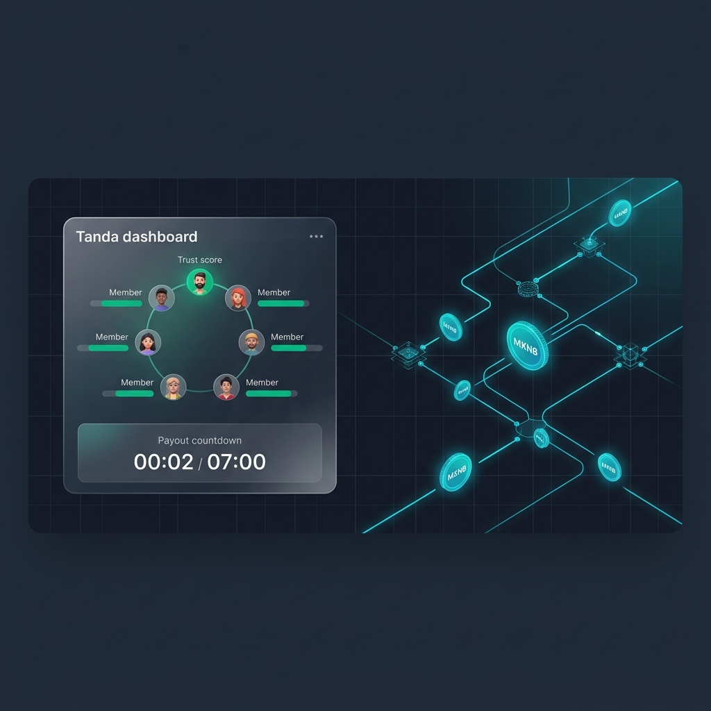
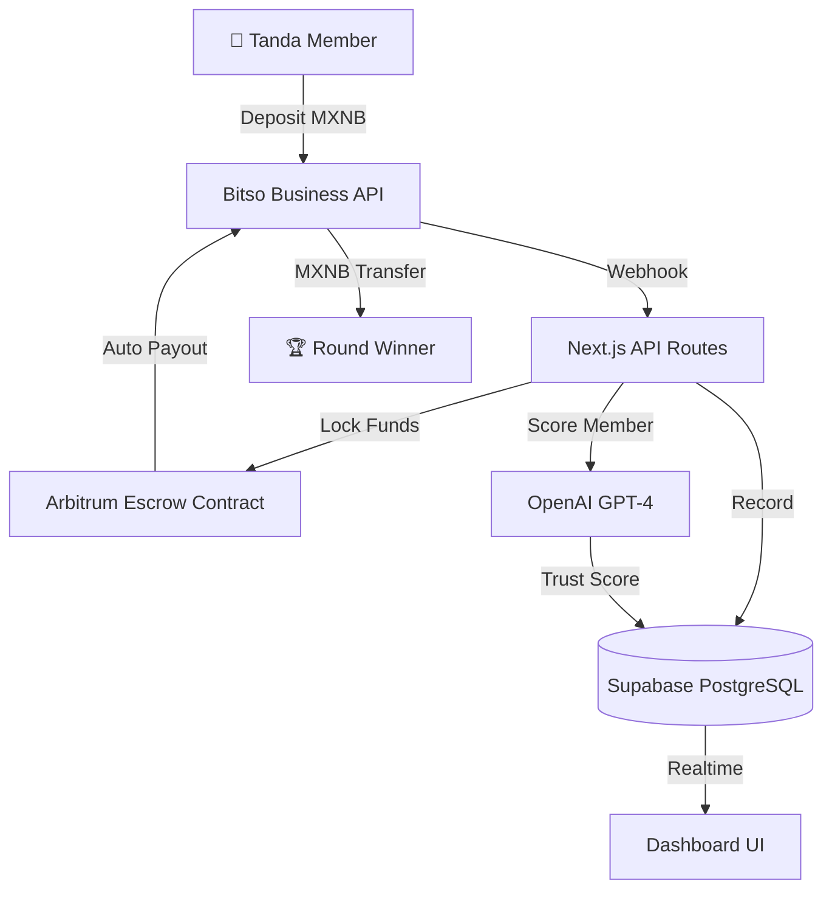

<div align="center">
  <h1>Tandot 🎰</h1>
  <p><em>¿Tu organizador de tanda se fue con el dinero? Nunca más. AI + smart contracts garantizan cada pago.</em></p>
  

  <br/>

  [](https://tandot.edycu.dev)
  [](https://tandot.edycu.dev/pitch)
  [](https://youtu.be/your-video)
  [](https://dorahacks.io/hackathon/ethmexico2026bitso/detail)

  <br/>

  
  
  
  
  
  
  [](https://github.com/edycutjong/tandot/actions/workflows/ci.yml)

</div>

---

## 📸 See it in Action

<div align="center">
  
</div>

> **Three steps, zero trust required.** Únete → Contribuye en MXNB → Cobra tu turno.

---

## 💡 The Problem & Solution

In Mexico, **tandas** (rotating savings circles) are the most popular informal savings tool — yet 1 in 3 tandas fail because the organizer disappears with the money. There's no recourse, no insurance, no proof.

**Tandot** eliminates the human organizer entirely. An AI agent manages trust scoring, group matching, and fraud detection, while MXNB (the Mexican peso stablecoin) flows through Arbitrum escrow smart contracts — guaranteeing every payout, every round, every time.

**Key Features:**
- 🤖 **AI Trust Scoring:** GPT-4 evaluates each member's reliability (0-100) using 5-factor analysis: payment history, on-time rate, group diversity, account age, and referral quality.
- 💰 **MXNB Escrow on Arbitrum:** All contributions flow into a trustless smart contract — funds are locked until automatic payout conditions are met.
- 🔒 **Fraud-Proof by Design:** No single person controls the pool. The contract enforces rotation order and the AI flags risky members before they join.
- 🎨 **Bilingual Premium UX:** Spanish-first emotional design with English technical depth. Glassmorphism fintech aesthetic, dark mode, Inter + JetBrains Mono + Outfit typography.

## 🏗️ Architecture & Tech Stack

| Layer | Technology |
|---|---|
| **Frontend** | Next.js 16 (App Router), React 19 |
| **Styling** | Tailwind CSS v4 |
| **Database** | Supabase (PostgreSQL + Realtime) |
| **Payments** | Bitso Business API (Pay-ins, Payouts, MXNB, Webhooks, Mass Payouts) |
| **Chain** | Arbitrum (MXNB stablecoin, escrow smart contract) |
| **AI** | OpenAI GPT-4 (trust scoring, group matching, fraud detection) |

| **Deploy** | Vercel |



## 🏆 Sponsor Tracks Targeted

| Bounty | Prize | Integration |
|---|---|---|
| **Bitso Business Startup** | $3,900 | Pay-ins, Payouts, MXNB transfers, Webhooks, Mass Payouts — see `src/lib/` |
| **ETH Mexico Main** | $1,500 | Full DeFi tanda platform solving financial trust in LATAM |
| **Arbitrum** | $650 | Escrow smart contract deployed on Arbitrum — see `contracts/` |


## 🚀 Getting Started

### Prerequisites
- Node.js ≥ 20
- npm

### Installation
```bash
git clone https://github.com/edycutjong/tandot.git
cd tandot
npm install
cp .env.example .env.local   # Add your API keys
npm run dev
```

> **For Judges:** Skip account creation! Use test credentials:
> **Email:** `judge@hackathon.com` | **Password:** `winner123`

## 🧪 Testing & CI

```bash
npm run lint          # ESLint (next lint)
npm run lint:fix      # Auto-fix lint issues
npm run typecheck     # TypeScript strict check
npm run test          # Run Jest tests
npm run test:coverage # Coverage report
npm run ci            # Full CI pipeline (lint + typecheck + test)
```

## 📁 Project Structure

```
tandot/
├── docs/              # README assets (hero, screenshots)
├── src/
│   ├── app/              # Next.js 16 App Router pages
│   │   ├── page.tsx      # Landing page (bilingual hero)
│   │   └── dashboard/    # Dashboard, tanda detail views
│   ├── components/       # React 19 components
│   └── lib/              # Types, constants, mock data, clients
├── db/
│   └── schema.sql        # Supabase schema (tandas, members, contributions, payouts)
├── contracts/            # Solidity escrow contract
├── public/               # Icon, OG image
├── .env.example          # Environment variable template (with source URLs)
├── .github/workflows/    # CI pipeline (Node 20/22/24 matrix)
└── README.md             # You are here
```

## 📄 License

[MIT](LICENSE) © 2026 Edy Cu

## 🙏 Acknowledgments

Built for **DoraHacks Ethereum Mexico 2026**. Thank you to Bitso, Arbitrum, and the ETH Mexico community for the APIs, tools, and inspiration.

¡Gracias por revisar este proyecto! 🇲🇽
